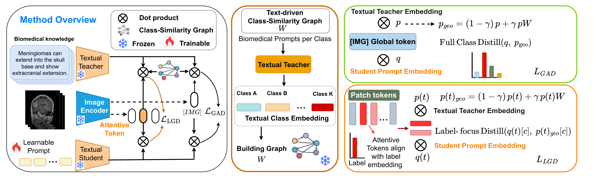

# OGKD: Omni-Geometry Knowledge Distillation for Prompt Tuning Biomedical Vision-Language Models



<p align="center"><em>Overview of the OGKD framework.</em></p>

From biomedical text prototypes, we build a class graph **W** that captures
semantic relations among classes. A geometry strength γ smooths the teacher
distribution and supervises two distillation losses: (1) **GAD** operates at the
global `[IMG]` token; (2) **LGD** operates at patch-token level, where `c` denotes
the ground-truth class. Only the student prompts are updated; the encoders and
**W** remain frozen.

## Installation
We use [micromamba](https://mamba.readthedocs.io/en/latest/installation/micromamba-installation.html) 
to create the environment.

```bash
# 1. Install micromamba
# Skip if you already have conda/micromamba.
"${SHELL}" <(curl -L micro.mamba.pm/install.sh)

# 2. Create environment
micromamba create -n ogkd python=3.10 -y
micromamba activate ogkd

# 3. Install PyTorch 
pip install torch==2.0.1 torchvision==0.15.2 --index-url https://download.pytorch.org/whl/cu118

# 4. Install the remaining dependencies
pip install -r requirements.txt
```

## Data preparation

```bash
python scripts/download_data.py        # downloads to $DATA_ROOT (default /workspace/dataset_raw)
python scripts/copy_dataset_jsons.py   # installs the official split JSONs (from data/) into $DATA_ROOT
```

## Training and Evaluation

```bash
# Base-to-novel generalization (train base 16-shot, evaluate novel), 3 seeds.
# (BUSI is excluded from base-to-novel due to its limited class):
bash scripts/run_base2novel.sh --datasets btmri chmnist covid ctkidney dermamnist kneexray kvasir lungcolon octmnist retina

# Few-shot classification, 3 seeds (16-shot by default), all 11 datasets:
bash scripts/run_fewshot.sh --datasets btmri busi chmnist covid ctkidney dermamnist kneexray kvasir lungcolon octmnist retina
```

### Results

Each run writes per-seed logs and an **Excel** summary under `results/<...>/`:

- base-to-novel → `results_base2novel.xlsx` (`base_acc`, `novel_acc`, `HM`),
- few-shot → `results_fewshot_<K>shot.xlsx` (`accuracy`, mean±std).

You can also regenerate the Excel from existing logs:

```bash
python scripts/results_to_excel.py --mode fewshot \
  --results-dir results/fewshot/shots_16/<stamp> --datasets btmri --seeds 1 2 3 --shots 16 \
  --out summary.xlsx
```

## Repository layout

```
train.py                       entry point (registers the trainer + datasets, builds the Dassl trainer)
trainers/method/               OGKD trainer (trainer.py), GAD/LGD losses (losses.py),
                               class-graph builders (geometry.py), teacher prompt bank (prompt_templates.py)
datasets/                      11 biomedical dataset definitions
configs/datasets/              per-dataset definitions
configs/trainers/OGKD/         base_to_novel/ and few_shot/ hyperparameter configs (one YAML per dataset)
data/<DS>/split_<DS>.json      train/val/test split files
scripts/                       run_base2novel.sh, run_fewshot.sh, data + Excel helpers
Dassl.pytorch/, open_clip/     vendored third-party frameworks
```
